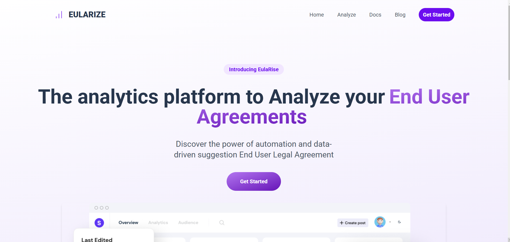
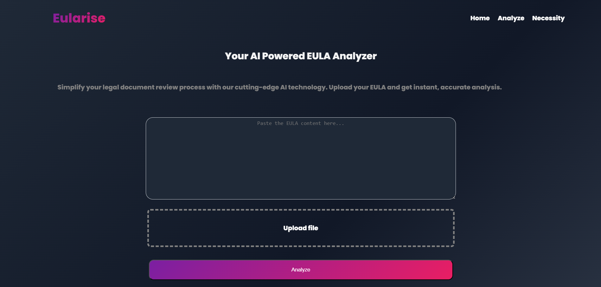
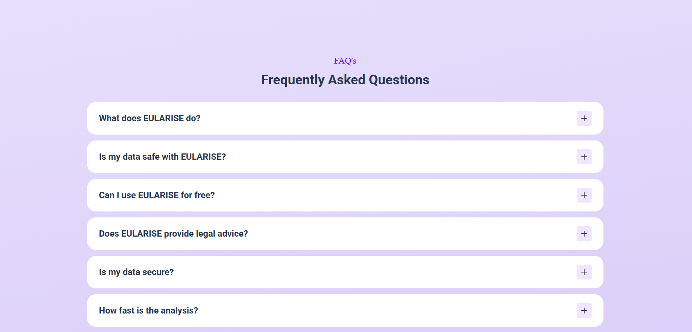

# EulaRise

## Description
EulaRise is an analytics platform designed to analyze End User Agreements (EULAs). It leverages AI technology to detect harmful clauses and provide actionable insights, simplifying legal agreements for users.

## Features
- **AI-Powered Analysis**: Detects harmful clauses and legal risks.
- **Smart Scanning**: Leverages AI to provide real-time insights on agreements.
- **User-Friendly Interface**: Easy navigation and interaction for users.

## Getting Started
To get started with EulaRise, visit the [Get Started](http://localhost:5000/get-started) page.

## Images

## License
This project is licensed under the MIT License.
